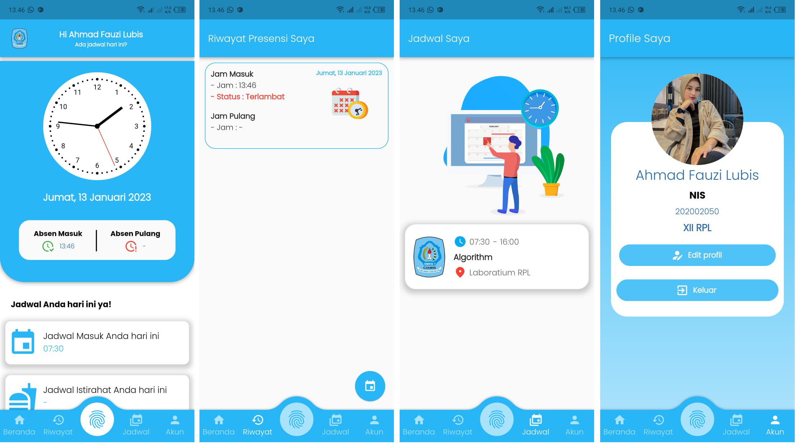

# Aplikasi Presensi

  

Aplikasi presensi siswa untuk sekolah SMKN 1 Ciamis menggunakan Flutter. Fitur:

- Login dan sesi beserta validasi.
- Verifikasi email.
- Absensi menggunakan koneksi WiFi di lab RPL.
- Riwayat absensi & filter berdasarkan tanggal.
- Melihat jadwal pelajaran.
- Halaman profil.
- One device per user.

## Download

Kalian bisa download [disini](https://github.com/Ahmadfzlbs/presensi-sekolah/releases/latest).

_Screenshot isi aplikasi_
